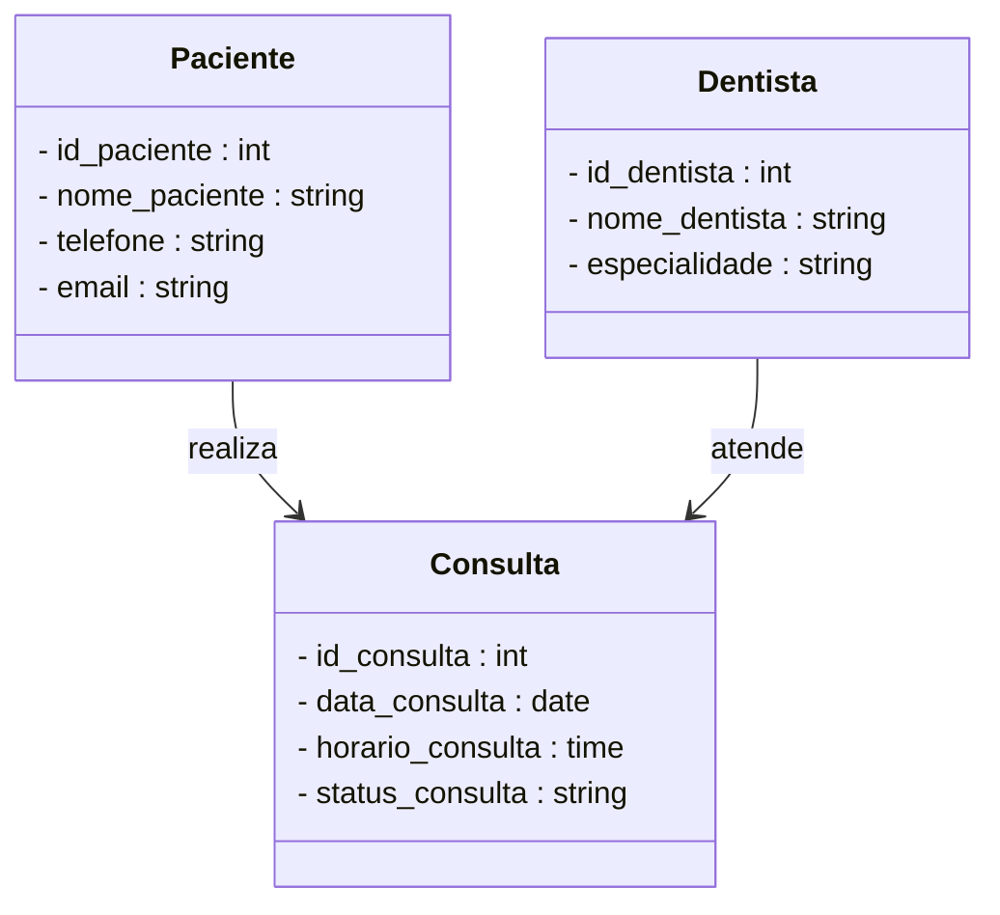

# Sistema de Agendamento - Clínica Dentária

Sistema simples de agendamento de consultas para clínica odontológica, desenvolvido com PHP puro, sem uso de frameworks.

## Sobre o Projeto

Este sistema tem como objetivo organizar a agenda de uma clínica dentária, permitindo o cadastro de pacientes e o agendamento de consultas de forma prática, evitando conflitos de horários.

O sistema simula o funcionamento de uma recepção, onde é possível verificar horários disponíveis, cadastrar pacientes e registrar atendimentos.

## Tecnologias Utilizadas

* PHP
* MySQL
* HTML
* CSS
* JavaScript

## Funcionalidades

* Cadastro de pacientes
* Cadastro de dentistas
* Agendamento de consultas
* Validação de conflitos de horários
* Listagem de consultas
* Cancelamento e edição de agendamentos

## Estrutura do Banco de Dados

O sistema possui três tabelas principais:

* pacientes: armazena os dados dos pacientes
* dentistas: armazena os profissionais e suas especialidades
* consultas: registra os agendamentos realizados

## Fluxo do Sistema

1. O paciente é cadastrado, caso ainda não exista
2. A recepcionista seleciona o dentista, data e horário
3. O sistema verifica se o horário está disponível
4. Se disponível, o agendamento é confirmado
5. Caso contrário, o sistema solicita a escolha de outro horário

## Estrutura do Projeto
* Conexao.php: responsável pela conexão com o banco de dados.
* index.php: arquivo principal que inicia o sistema.
  
### Pastas do Projeto

## controllers/: contém os controladores responsáveis pela lógica do sistema.
* ConsultaController.php
* DentistaController.php
* PacienteController.php

## models/: contém as classes de modelo, responsáveis pela manipulação dos dados.
* Consulta.php
* Dentista.php
* Paciente.php
  
## routes/: contém as rotas para salvar os dados no sistema.
* salvar_consulta.php
* salvar_dentista.php
* salvar_paciente.php

## views/: contém as telas/interfaces do sistema.
* public/css/: arquivos de estilização do sistema.
* style.css
  
## dbo/: contém o banco de dados do projeto.
* meu banco de dados

## Objetivo

Este projeto foi desenvolvido com o objetivo de praticar:

* Operações CRUD
* Integração com banco de dados
* Organização de código em PHP puro
* Validações de regras de negócio

## Diagrama de Classes

## Status do Projeto

Começando - Em desenvolvimento

Marcela Cabral
