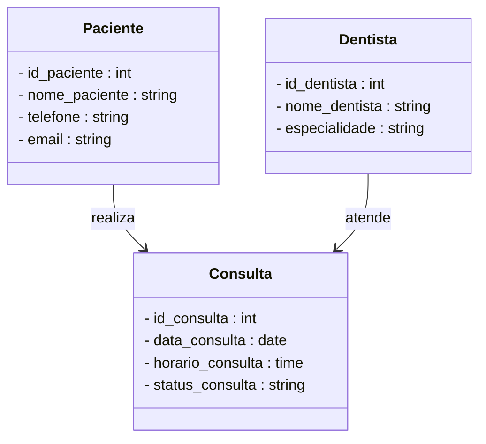

# Sistema de Agendamento - Clinica Dentaria

Sistema de agendamento de consultas para clinica odontologica, desenvolvido com Laravel 11 e SQLite. O sistema organiza a agenda da clinica, permitindo o cadastro de pacientes, dentistas e consultas de forma pratica, evitando conflitos de horarios.

## Tecnologias

- PHP 8.2+
- Laravel 11
- SQLite
- Blade Templates
- PHPUnit

## Funcionalidades

- Cadastro de pacientes (nome, telefone, e-mail unico)
- Cadastro de dentistas (nome, especialidade)
- Agendamento de consultas com validacao de conflito de horario
- Listagem e remocao de registros
- Validacao de formularios com mensagens em portugues
- Protecao CSRF automatica
- Alertas de sucesso e erro

## Fluxo do Sistema

1. O paciente e cadastrado, caso ainda nao exista
2. A recepcionista seleciona o dentista, data e horario
3. O sistema verifica se o horario esta disponivel
4. Se disponivel, o agendamento e confirmado
5. Caso contrario, o sistema solicita a escolha de outro horario

## Estrutura do Projeto

```
clinica-dentaria/
├── app/
│   ├── Http/
│   │   └── Controllers/
│   │       ├── PacienteController.php
│   │       ├── DentistaController.php
│   │       └── ConsultaController.php
│   ├── Models/
│   │   ├── Paciente.php
│   │   ├── Dentista.php
│   │   └── Consulta.php
│   └── Providers/
│       └── AppServiceProvider.php
├── database/
│   ├── migrations/
│   │   ├── ..._create_pacientes_table.php
│   │   ├── ..._create_dentistas_table.php
│   │   └── ..._create_consultas_table.php
│   └── seeders/
│       └── DatabaseSeeder.php
├── legacy/
├── resources/
│   └── views/
│       ├── layouts/app.blade.php
│       ├── home.blade.php
│       ├── pacientes/
│       ├── dentistas/
│       └── consultas/
├── routes/
│   └── web.php
└── public/
    └── css/style.css
```

## Banco de Dados

Tres tabelas principais:

- `pacientes` — dados dos pacientes
- `dentistas` — profissionais e suas especialidades
- `consultas` — agendamentos realizados

## Diagrama de Classes


```mermaid
classDiagram

class Paciente {
  - id_paciente : int
  - nome_paciente : string
  - telefone : string
  - email : string
}

class Dentista {
  - id_dentista : int
  - nome_dentista : string
  - especialidade : string
}

class Consulta {
  - id_consulta : int
  - data_consulta : date
  - horario_consulta : time
  - status_consulta : string
}

Paciente --> Consulta : realiza
Dentista --> Consulta : atende
```

## Instalacao

```bash
composer install
cp .env.example .env
php artisan key:generate
touch database/database.sqlite
php artisan migrate
php artisan serve
```

Acesse: http://localhost:8000

## Testes

```bash
php artisan test
```

## Objetivo

Projeto desenvolvido para praticar operacoes CRUD, integracao com banco de dados, organizacao de codigo com Laravel e validacoes de regras de negocio.

## Status

Em desenvolvimento

---

Marcela Cabral